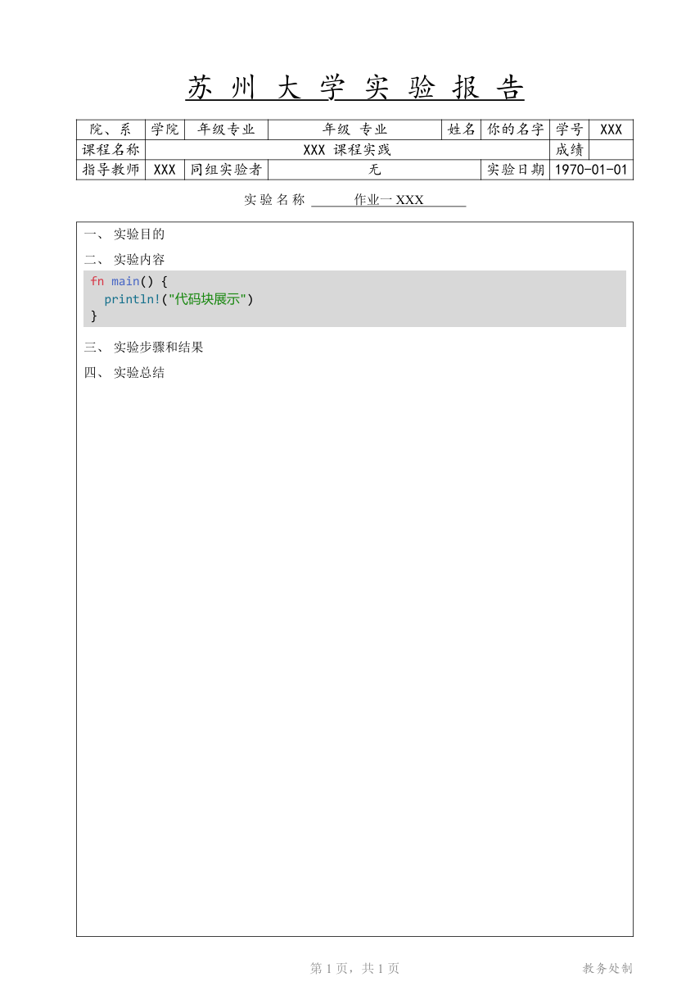

# 苏州大学实验报告 Typst 模板

原作为 [imnotlxy/suda-lab-report-typst](https://codeberg.org/imnotlxy/suda-lab-report-typst)，发布在 codeberg 上。  
考虑到平台知名度，我将其略微修改后上传到该 Github 仓库。

## 效果图

## 免责声明

本项目并非由苏州大学或其教务处发布，发布的目的是方便苏州大学的学生进行实验报告排版。若模板有问题，请在此仓库或是原作仓库报告，苏州大学及其教务处没有义务修复或维护。  

本模板旨在为苏州大学学生提供实验报告排版的便利工具，不完全符合苏州大学的官方格式要求。使用本模板前，请务必确认您的课程或院系是否有特定的实验报告格式要求。  

请合理使用本项目。苏州大学名称、徽标等标识归苏州大学所有，本模板中的使用仅为指示目的。
